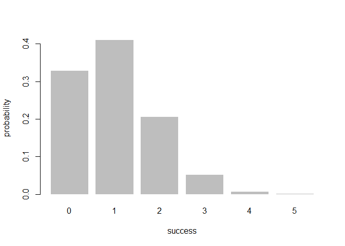
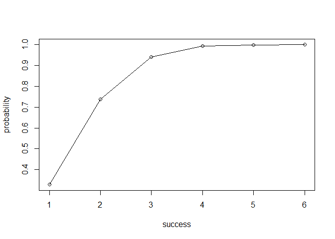

Overview
--------

`"binomial"` binomial is a package that implement functions for calculating probabilities of a Binomial random variable, and related calculations such as the probability distriburion, the expected value, variance, etc.

-   `bin_variable()` creates a binomial random variable object (of class `"binvar"`)
-   `bin_distribution()` create a object of `"bindis"` class and ouput a table that display the probability distriburion.
-   `bin_cumulative()` create a object of `"bincum"` class and ouput a table that display the probability distribution
-   `plot()` method for `"bindis"` and `"bincum"` objects to plot the probability distriburion histogram and cumulative probability distribution plot.
-   `summary()` method for a `"binvar"` object.
-   `bin_mean()`: calculate the mean of the binomial random variable
-   `bin_variance()`: calculate the variance of the binomial random variable
-   `bin_mode()`: calculate the mode of the binomial random variable
-   `bin_skewness()`: calculate the skewness of the binomial random variable
-   `bin_kurtosis()`: calculate the kurtosis of the binomial random variable

Motivation
----------

This package has been developed to illustrate some of the concepts behind the creation of an R package.

Installation
------------

Install the development version from GitHub via the package `"devtools"`:

``` r
# development version from GitHub:
#install.packages("devtools") 
# install "binomial" (without vignettes)
devtools::install_github("eden98lin/binomial")
# install "binomial" (with vignettes)
devtools::install_github("eden98lin/binomial", build_vignettes = TRUE)
```

Usage
-----

``` r
library(binomial)
# a binomial random variable with n = 5, p = 0.2
rand_var <- bin_variable(5, 0.2)
rand_var
#> "Binomial variable"
#> 
#> - number of trials: 5 
#> - prob of success: 0.2
# summary of measures of the binomial random variable
bin_sum <- summary(rand_var)
bin_sum
#> "Summary Binomial"
#> 
#> Paramaters 
#> - number of trials: 5 
#> - prob of success: 0.2 
#> 
#> Measures 
#> - mean    : 1 
#> - variance: 0.8 
#> - mode    : 1 
#> - skewness: 0.6708204 
#> - kurtosis: 0.05
# binomial probability distribution and binomial cumulative probability distribution
dist1 <- bin_distribution(5, 0.2)
dist1
#>   success probability
#> 1       0     0.32768
#> 2       1     0.40960
#> 3       2     0.20480
#> 4       3     0.05120
#> 5       4     0.00640
#> 6       5     0.00032
dist2 <- bin_cumulative(5, 0.2)
dist2
#>   success probability cumulative
#> 1       0     0.32768    0.32768
#> 2       1     0.40960    0.73728
#> 3       2     0.20480    0.94208
#> 4       3     0.05120    0.99328
#> 5       4     0.00640    0.99968
#> 6       5     0.00032    1.00000
# plot
plot(dist1)
```



``` r
plot(dist2)
```


